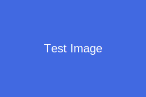

# 画像表示テスト

このマークダウンファイルは、実際の画像ファイルを使用して画像表示機能のテストを行います。

## ローカル画像の表示

以下は実際のSVG画像です:

## Web画像の表示

以下はWeb上の画像です:

## パス指定のテスト

### 1. サブディレクトリ内の画像

### 2. タイトル付き画像

## 複数の画像

## 説明

- ローカル画像はBase64エンコードされてData URLとして埋め込まれます
- Web画像はそのままURLが使用されます
- 画像が見つからない場合はaltテキストが表示されます
