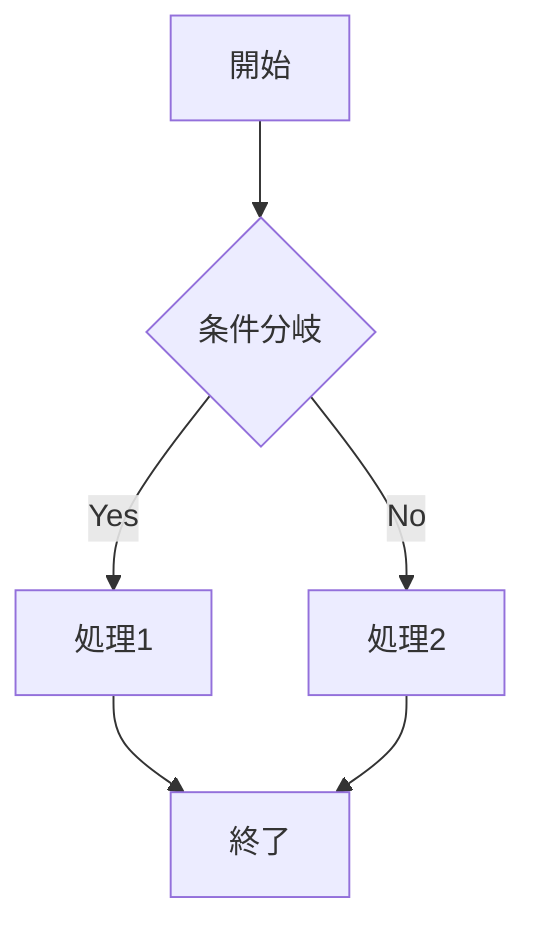
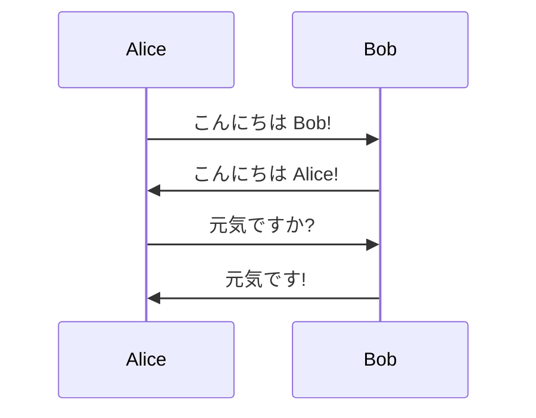
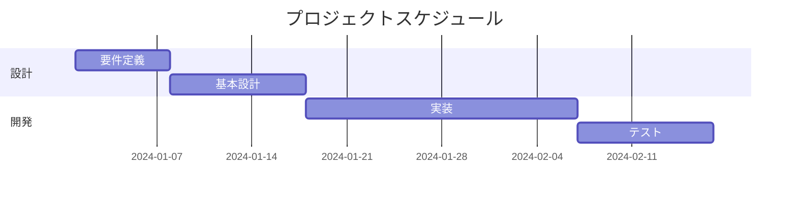
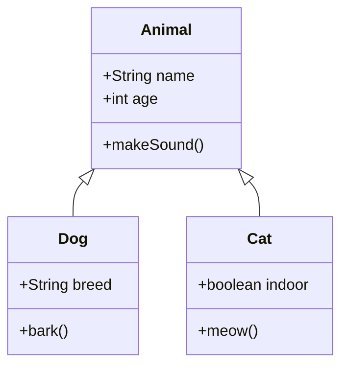
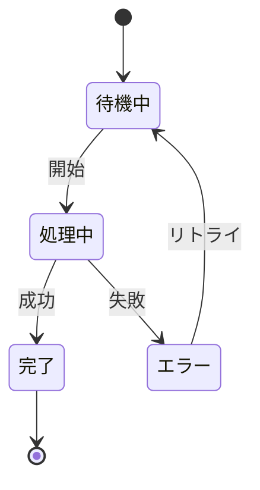
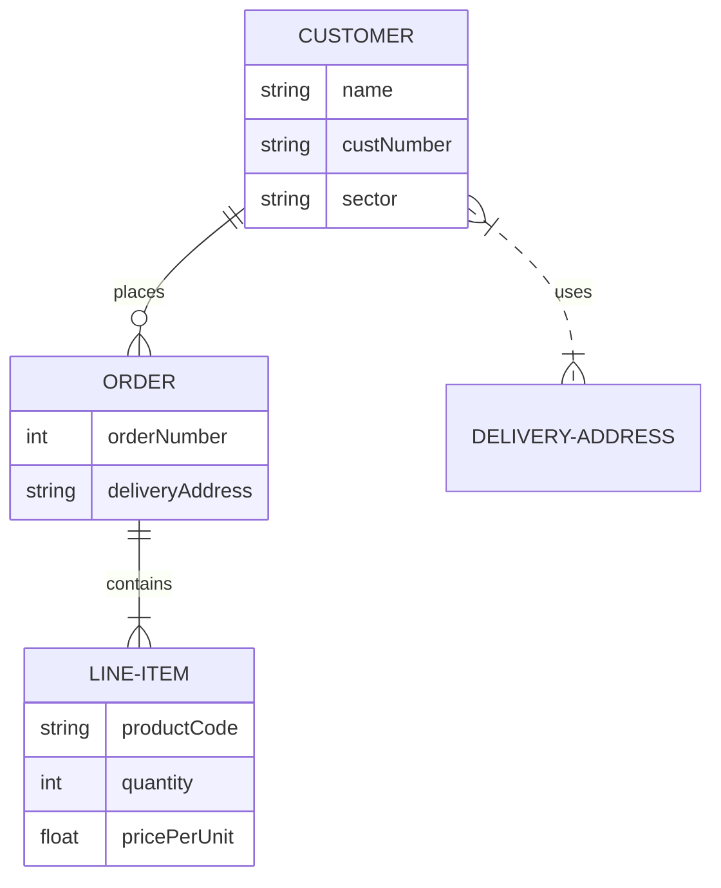

# Markdown Viewer Test

## Features

This is a **GitHub-compatible** markdown viewer built with Electron.

### Supported Elements

- **Bold text**
- *Italic text*
- ~~Strikethrough~~
- `inline code`
- [Links](https://github.com)

### Code Blocks

```python
def hello_world():
    print("Hello, World!")
    return 42

if __name__ == "__main__":
    result = hello_world()
    print(f"Result: {result}")
```

```javascript
function fibonacci(n) {
  if (n <= 1) return n;
  return fibonacci(n - 1) + fibonacci(n - 2);
}

console.log(fibonacci(10));
```

### Tables

| Feature | Status | Priority |
|---------|--------|----------|
| Syntax highlighting | ✅ | High |
| GitHub CSS | ✅ | High |
| Scrolling | ✅ | High |
| Auto-reload | ❌ | Low |

### Blockquotes

> This is a blockquote.
> 
> It can span multiple lines.

### Task Lists

- [x] Create Electron app
- [x] Add markdown parsing
- [x] Style with GitHub CSS
- [ ] Add file watching

### Horizontal Rule

---

### Images (if you have any)


## Mathematical Expressions

Inline math: $E = mc^2$

Block math:

$$
\frac{n!}{k!(n-k)!} = \binom{n}{k}
$$

## Mermaid Diagrams

### フローチャート



### シーケンス図



### ガントチャート



### クラス図



### 状態遷移図



### ER図



## Conclusion

This viewer supports most GitHub Flavored Markdown features, including Mermaid diagrams!
